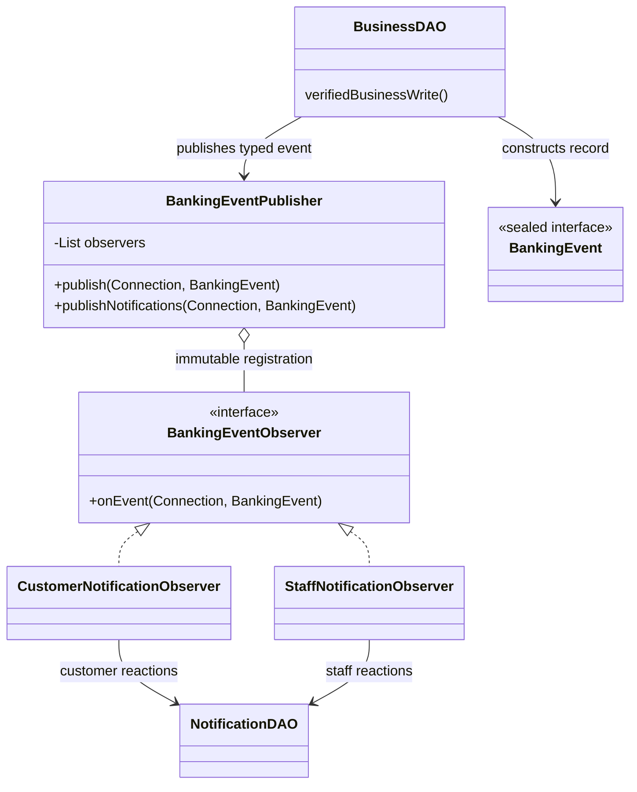

# SE2030 — Shared Observer Pattern Viva Guide

## Implemented Scope and Ownership

This document explains the completed **Observer Pattern (Behavioral)** refactor.

Dashboard Strategy, Card Factory, Investment Strategy, Singleton, Decorator, email/SMS delivery, and asynchronous delivery were **not implemented**.

Existing routes, views, database schema, and the notification read/unread API were not changed.

The member allocation below is the mapping confirmed by the user from the proposal. The descriptions in proposal sections 7.4/7.5 are not used as evidence of implementation ownership. Since the proposal file was not available in the workspace, the confirmed module headings and actual source code were used to determine scope.

This document does **not** claim that every feature mentioned in the proposal was implemented.

| Member | ID | Confirmed Module |
|---|---|---|
| Ellepola E.I.W.A.S | IT25102492 | Loan Management |
| Mathuziyanth T | IT25100557 | Credit & Debit Card Management |
| Gunarathna A.A.K | IT25101484 | Investment & Payment Management |
| Monisha S | IT25103368 | Account & Service Request Management |
| Thennakoon T.P.J.H | IT25101687 | Customer Support, Complaint & Reporting Management |
| Sewmahal D.H.P | IT25103574 | Administration Management |

Compliance & Risk is a system role. It is not a seventh member or a separate member-assigned module. Its existing notification point was preserved in the shared implementation.

**Module ownership does not mean code authorship.**

The refactor changes were generated with the help of a coding assistant. This document does not claim that the members personally wrote every change.

Each member should review the code and understand their own workflow, event, observer callback, transaction handling, and demonstration flow well enough to explain them during the viva.

The provided assessment requirement asks for at least one suitable design pattern in the system. It does not state that six different patterns must be implemented.

Because the lecturer may assess individual contribution and understanding, every member should be able to explain their own integration points in the shared Observer Pattern implementation.

No marks are guaranteed.

---

## Original Problem and Why Observer Fits

Before the refactor, business DAOs directly called notification-specific methods:

```java
NotificationDAO.changed(c, NotificationDAO.Product.LOAN, loan);
```

Existing notifications already existed for:

- Loan decisions
- Card decisions
- Investment decisions
- Service request decisions
- Payments
- Account changes
- Support actions

The problem was that the business code directly knew which notification reaction method should be called.

There was no common callback and registration mechanism for customer notifications and staff notifications.

Now, the business code publishes a typed internal event:

```java
BankingEventPublisher.publishNotifications(c,
        new BankingEvent.ProductChanged(BankingEvent.Product.LOAN, loan));
```

The publisher synchronously dispatches the event to two registered observers.

If an observer is interested in the event, it calls the relevant existing `NotificationDAO` persistence/rendering helper.

If the event is irrelevant to that observer, it ignores the event.

This is not simply a renamed wrapper around the original direct call.

The implementation contains:

- An observer interface
- An immutable observer registration list
- Multiple concrete observers
- Iteration-based callback dispatch

For example, when an account freeze event occurs, both the customer observer and the staff observer execute their existing reactions.

Most existing notification text and SQL were reused from `NotificationDAO`.

Business actions, balance calculations, authorization logic, and audit logic were **not moved into observers**.

---

## Exact Pattern Roles

All implementation files are under:

```text
src/main/java/com/banking/dao/
```

| Role | File/Class | Exact Methods / Purpose |
|---|---|---|
| Subject / Publisher | `BankingEventPublisher.java` | Constructor copies registered observers using `List.copyOf`; `publish(Connection, BankingEvent)` loops through observers and invokes callbacks; `publishNotifications(...)` dispatches using the fixed production registration |
| Observer Contract | `BankingEventObserver.java` | Defines `onEvent(Connection, BankingEvent) throws SQLException` |
| Customer Concrete Observer | `CustomerNotificationObserver.java` | `onEvent()` handles product, account, profile, payment, and customer-ticket notifications |
| Staff Concrete Observer | `StaffNotificationObserver.java` | `onEvent()` handles submissions, frozen-account admin notices, registrations, employee-access changes, department-ticket notices, and customer replies |
| Typed Event Contract | `BankingEvent.java` | Sealed interface with immutable record payloads; nested `Product` enum keeps trusted product/table metadata |
| Existing Persistence Collaborator | `NotificationDAO.java` | Contains `submitted`, `changed`, `accountChanged`, new `accountStaffChanged`, `profileChanged`, `registered`, `employeeAccess`, `payment`, `paymentId`, `customer`, `department`, and `customerReply` |
| Event Producers | Existing DAOs listed in the member sections | Publish events only at existing successful-write notification points |
| Transaction Owner | Existing DAO / `Jdbc.transaction()` | Starts the transaction and commits or rolls back; the publisher and observers do neither |

`NOTIFICATIONS` is a fixed shared registration.

It is **not** a newly introduced Singleton Pattern contract.

There is no mutable subscribe/unsubscribe UI or session-based observer registration.

Constructor-based registration is sufficient for this fixed Observer use case.



---

## Event Routing

| Typed Record | Payload | Customer Reaction | Staff Reaction |
|---|---|---|---|
| `ProductSubmitted` | Product enum, entity ID | None | Relevant active product officer role |
| `ProductChanged` | Product enum, entity ID, optional existing action | Existing status notification for the entity owner | None |
| `AccountChanged` | Account number | Account status notification for the owner | Admin notification only when status is `FROZEN` |
| `ProfileChanged` | Customer ID | Existing profile access notification | None |
| `CustomerRegistered` | Customer ID | None | Active administrators |
| `EmployeeAccessChanged` | Employee ID, actor ID | None | Other active administrators; actor is excluded |
| `PaymentRecorded` | Existing payment reference | Payer; receiver also notified for completed transfers | None |
| `PaymentChanged` | Existing payment ID | Resolves payment reference and preserves existing payment reaction/deduplication | None |
| `CustomerReplied` | Ticket ID | None | Assigned department, not only the last handler |
| `TicketCustomerNotice` | Ticket ID, existing type/title/message | Ticket owner | None |
| `TicketDepartmentNotice` | Ticket ID, role, optional specific officer/actor, existing type/title/message | None | Existing active department recipients with actor exclusion |

Ticket records preserve the existing notification message strings and notification types in order to keep this refactor small.

Therefore, support-related producers still construct some display text.

Full message-rendering decoupling is **not claimed**.

Recipient ownership queries remain server-side.

Event records are internal objects and do not introduce a new HTTP API.

---

# 1. Ellepola E.I.W.A.S — IT25102492 — Loan Management

## Actual Flow and Changed Code

- Customer `/customer/loans` form
  → `CustomerServicesServlet.doPost()`
  → `LoanDAO.apply()`
  → `ProductSubmitted(LOAN,id)`
  → Staff Observer
  → `NotificationDAO.submitted()`
  → Active Loan Officers

- `LoanDAO.decision()` is called from `EmployeeServlet.doPost()`.
  It publishes `ProductChanged(LOAN,id)`.
  The Customer Observer handles the event and calls `changed()`.
  The loan owner receives the approved/rejected notification.

- `LoanDAO.cancel()` preserves the existing cancellation notification through `ProductChanged`.

- `LoanDAO.accept()` keeps the existing account-credit and installment insertion logic.
  It then publishes `ProductChanged` for the ACTIVE loan.

- The existing `FinancialLedger.record()` separately publishes the **payment event**.

- Therefore, the loan-state notification and payment notification are two different existing reactions. They are not duplicate publication of the same event.

- `LoanRepaymentDAO.pay()` preserves the recorded installment amount and payment record.
  It publishes `PaymentRecorded`.

- For the final repayment, `ProductChanged` is published only when the loan genuinely becomes CLOSED.

- The remaining legacy `loan-reject` notification point in `EmployeeDAO.act()` also publishes `ProductChanged`.

Changed files:

```text
LoanDAO.java
LoanRepaymentDAO.java
FinancialLedger.java
EmployeeDAO.java
```

Loan rates and installment rules in `DemoRules` were not changed.

Loan application updates remain silent in places where they were silent before the refactor.

## Demonstration

Use one customer session and one Loan Officer session.

1. Apply for a valid loan.
2. Show the notification received by the Loan Officer.
3. Approve the loan.
4. Show the notification received by the customer.
5. Customer accepts the loan.
6. Show the account credit.
7. Show the ACTIVE loan state.
8. Show the recorded installment schedule.
9. Repay a one-installment test loan.
10. Show the payment notification.
11. Show the CLOSED loan notification.
12. Repeat approval, acceptance, or repayment attempts to prove that invalid/repeated transitions do not create extra successful notifications.

## Viva

| Question | Simple Answer |
|---|---|
| Why does Observer fit here? | When the loan lifecycle changes, the existing notification component reacts to the event. `LoanDAO` no longer selects the notification recipient/message persistence method directly. |
| Why did you not use Strategy for loan types? | The current loan types use the same configured rate and algorithm, so creating duplicate Strategy classes would not provide a real benefit. |
| Are funds released immediately after approval? | No. Funds are disbursed only after the customer accepts the approved loan. |
| How can a new observer be added? | Implement the observer interface and add the implementation to the publisher's registration list while following the existing transaction rules. |

---

# 2. Mathuziyanth T — IT25100557 — Credit & Debit Card Management

## Actual Flow and Changed Code

- Customer `/customer/cards`
  → `CustomerServicesServlet`
  → `CardDAO.apply()`
  → existing common and debit/credit subtype inserts
  → `ProductSubmitted(CARD,id)`
  → active Card Services Officers

- `CardDAO.process()` handles:
  - Approve
  - Reject
  - Block
  - Unblock
  - Close

  It publishes:

```java
ProductChanged(CARD, id, action)
```

The Customer Observer handles the event and sends the existing card-owner notification.

- `CardDAO.customerAction()` also uses the same event for block/cancel/close actions.

- **Daily limit edits remain silent.**

- The optional `action` field is necessary because rejected cards use the existing `CANCELLED` status in the schema. Without the action, the observer cannot distinguish rejection from another cancellation case while preserving the original rejection wording.

- Legacy points in `CustomerServicesDAO.blockCard()` and `EmployeeDAO.act()` were also migrated to typed events.

Changed files:

```text
CardDAO.java
CustomerServicesDAO.java
EmployeeDAO.java
```

No Card Factory was added.

No new card-network issuance mechanism was added.

No card subtype schema changes were made.

## Demonstration

1. Request a debit card.
2. Request a credit card.
3. Show the correct officer notifications.
4. If necessary, use read-only SQL to show the correct subtype records.
5. Approve one card.
6. Block it.
7. Unblock it.
8. Show the customer notifications.
9. Reject a pending card.
10. Show that the rejection wording is correct.
11. Edit the daily limit.
12. Demonstrate that no unnecessary notification is created.
13. Show duplicate-request and closure/debt protection behaviour.

## Viva

| Question | Simple Answer |
|---|---|
| Who are the concrete observers? | `StaffNotificationObserver` handles card submission notifications, while `CustomerNotificationObserver` handles card status-change notifications. |
| Why is the action field required? | A rejected card is stored using the existing `CANCELLED` status, so the action is needed to preserve the original rejection meaning and message. |
| Was card creation changed? | No. The original transaction and debit/credit SQL structure remain unchanged. |
| How would you add a new card notification reaction? | Add handling for the appropriate typed event in an observer implementation and register it. We should not invent unsupported card types. |

---

# 3. Gunarathna A.A.K — IT25101484 — Investment & Payment Management

## Actual Flow and Changed Code

- Investment form
  → `CustomerServicesServlet`
  → `InvestmentDAO.apply()`
  → `ProductSubmitted(INVESTMENT,id)`
  → Investment Officers

- `process()` approval/funding/rejection, `cancel()`, `payout()` withdrawal, and maturity closure publish `ProductChanged`, which is handled by the customer observer.

- Investment funding and payout use:

```java
FinancialLedger.record()
```

This publishes `PaymentRecorded(reference)` exactly once for the existing financial notification.

The caller does not republish the same payment event.

- Bill payment form
  → `PaymentServlet`
  → `PaymentDAO.makeBillPayment()`
  → `PaymentRecorded`
  → payer notification

- Transfer form
  → `TransferServlet`
  → `TransferDAO.transferMoney()`
  → `PaymentRecorded`
  → payer and actual receiver from the recorded destination account

- Scheduled payment form
  → `ScheduledPaymentServlet`
  → `ScheduledPaymentDAO.cancel()/execute()`
  → `PaymentChanged(id)`
  → existing cancellation/completion notification

Scheduled payment creation and editing remain silent.

- Shared staff cash deposit/withdrawal through `CashTransactionDAO` also publishes `PaymentRecorded`.

This is operational overlap with the Customer Service role and does not represent a new module-owner assignment.

Changed files:

```text
InvestmentDAO.java
PaymentDAO.java
TransferDAO.java
ScheduledPaymentDAO.java
CashTransactionDAO.java
FinancialLedger.java
```

## Demonstration

1. Approve and fund an investment.
2. Show the account debit and notifications.
3. Withdraw the investment or process maturity.
4. Show the credited payout.
5. Show the CLOSED investment status.
6. Transfer money between two test customers.
7. Show both balances.
8. Show notifications for the payer and receiver.
9. Execute an already-due scheduled payment.
10. Retry the same payment.
11. Demonstrate that failed insufficient-funds operations create no committed payment and no committed notification.

## Viva

| Question | Simple Answer |
|---|---|
| How do you prevent double notifications? | Existing payment row locking and recipient/type/message deduplication are preserved. The shared helper and the caller do not publish the same payment event twice. |
| Was the interest formula changed? | No. Existing recorded terms and `DemoRules` remain unchanged. |
| Is the scheduled payment implemented as a background job? | No. It still uses the existing explicit execution action. |
| What happens if a new payment observer is added? | Register a new observer implementation. Updating balances remains the responsibility of the DAO, not the observer. |

---

# 4. Monisha S — IT25103368 — Account & Service Request Management

## Actual Flow and Changed Code

- Registration
  → `RegisterServlet`
  → `CustomerDAO.createCustomerAndAccount()`
  → `AccountChanged(accountNumber)` for the customer
  → `CustomerRegistered(customerId)` for administrators

These represent two distinct existing reactions.

- Customer request form
  → `CustomerServicesServlet`
  → `ServiceRequestDAO.create()`
  → `ProductSubmitted(REQUEST,id)`
  → Customer Service Officers

- Officer processing
  → `EmployeeServlet`
  → `ServiceRequestDAO.process()`
  → existing fulfillment switch
  → `ProductChanged` only when status or response genuinely changes
  → customer notification

- `ServiceRequestDAO.update()` publishes an event for cancellation.

- Ordinary description edits remain silent.

- Account opening/closure in:

```text
AccountWorkflowDAO.open()
AccountWorkflowDAO.close()
```

publishes `AccountChanged` inside the caller's transaction.

- Profile deactivation in:

```java
AccountWorkflowDAO.deactivate(Connection, int)
```

publishes `ProfileChanged`.

- Admin deactivation reuses this helper, so a duplicate caller event is not added.

- Legacy request creation/review points in `CustomerServicesDAO.request()` and `EmployeeDAO.act()` were also migrated.

Changed files:

```text
AccountWorkflowDAO.java
CustomerDAO.java
ServiceRequestDAO.java
CustomerServicesDAO.java
EmployeeDAO.java
```

A Service Fulfillment Strategy was not added.

## Demonstration

1. Submit an account-opening request.
2. Complete it.
3. Show the new account.
4. Show the service-request notification.
5. Complete a profile-update or statement request.
6. Show the result.
7. Try to close an account that still has a balance or outstanding obligations.
8. Show that the system rejects the closure.
9. Use an eligible zero-balance account.
10. Demonstrate successful closure.
11. Use only test fixtures for account deactivation and registration demonstrations.

## Viva

| Question | Simple Answer |
|---|---|
| Are the account event and request event duplicates? | No. Account status and request status belong to two different business records, and both notifications already existed before the refactor. |
| Did you remove ownership checks? | No. Existing authenticated identity checks and account/customer ownership queries are unchanged. |
| Does the observer close the account? | No. The workflow DAO closes the account and then publishes the event. The observer only creates the notification. |
| What is required for a new service-request type? | Existing validation, fulfillment logic, UI, and data support must be updated. The existing request event can normally be reused for notification handling. |

---

# 5. Thennakoon T.P.J.H — IT25101687 — Customer Support, Complaint & Reporting Management

## Actual Flow and Changed Code

- Complaint/support form
  → `CustomerServicesServlet`
  → `CustomerServicesDAO.ticket()`
  → `TicketDepartmentNotice`
  → active Customer Service Officers

The existing complaint-specific title and message are preserved.

- Assignment
  → `EmployeeServlet`
  → `TicketDAO.assign()`
  → existing `TicketCustomerNotice`
  → existing `TicketDepartmentNotice`
  → ticket owner and target department

The acting employee is excluded from the staff notification.

- Officer reply/status change
  → `TicketDAO.update()`
  → customer notification events

Escalation also produces a department notification with actor exclusion.

Repeating the same status remains silent as before.

- Customer reply
  → `CustomerServicesDAO.reply()`
  → `CustomerReplied(ticketId)`
  → entire assigned department

`assigned_employee_id` represents the last handler. It does not represent exclusive ticket ownership.

- Existing message records, status restrictions, and privacy rules remain unchanged.

Customer edits/self-closure inside `ServiceRequestDAO.ticketUpdate()` did not previously generate notifications, so no new notifications were invented.

Changed files:

```text
TicketDAO.java
CustomerServicesDAO.java
```

### Reporting Distinction

The actual administration-report implementation exists in:

```text
ReportDAO.generate()
AdminReportServlet
AdminReportPdf
WEB-INF/admin/reports.jsp
```

It is protected by `SYSTEM_ADMIN`.

It logs:

```text
REPORT_GENERATED
```

However, there was no existing notification point for report generation.

Therefore, no report event or report notification was added.

Reporting demonstration access should be coordinated with the Administration member.

The module heading does not override runtime authorization rules and does not prove that a separate customer complaint-report implementation exists.

## Demonstration

1. Submit a complaint.
2. Assign it to a department.
3. Officer sends a reply.
4. Customer sends a follow-up reply.
5. Resolve the ticket.
6. Close the ticket.
7. Show customer and department notifications.
8. Use a second officer to demonstrate actor exclusion.
9. Demonstrate denial for unrelated departments.
10. For reporting, use an authorized admin account.
11. Show existing report filters.
12. Show report preview.
13. Show PDF generation.
14. Explain that reporting is an existing feature, while this member's Observer Pattern integration is mainly in support and complaint workflows.

## Viva

| Question | Simple Answer |
|---|---|
| Are customers observers? | No. The Java notification components are observers. Customers are database notification recipients. |
| Why is there no report notification? | The existing implementation did not contain such a notification point, so we did not invent a new feature only to demonstrate the pattern. |
| Why is the customer reply notification sent to the whole department? | Current routing is department-wide. The last employee ID does not represent exclusive ownership of the ticket. |
| How would you add a new support reaction? | Register an observer that handles the appropriate typed event while preserving the existing ticket permissions and status rules. |

---

# 6. Sewmahal D.H.P — IT25103574 — Administration Management

## Actual Flow and Changed Code

- Admin employee form
  → `AccessFilter`
  → `EmployeeServlet.doPost()`
  → `AdminDAO.employee()`
  → role/status genuinely changes
  → `EmployeeAccessChanged(employeeId, adminId)`
  → Staff Observer
  → other active administrators

Ordinary name/contact edits remain silent.

- Legacy employee-status action
  → `EmployeeDAO.act()`
  → same event

The acting administrator is excluded from the notification recipients.

- `AdminDAO.customerStatus()` reactivation
  → `ProfileChanged`
  → Customer Observer

- Deactivation uses:

```java
AccountWorkflowDAO.deactivate()
```

which publishes the event once.

- Customer registration from the Account module emits:

```text
CustomerRegistered
```

Administration receives the existing notification through the shared staff observer.

- Compliance `EmployeeDAO.act()` freeze/unfreeze
  → `AccountChanged`

The Customer Observer creates the owner's notification.

The Staff Observer creates an administrator notification **only when the account becomes FROZEN**.

Compliance is a system role, not another project member.

Changed files:

```text
AdminDAO.java
EmployeeDAO.java
```

Product management, dashboards, self-access restrictions, recent activity, and reports remain unchanged.

No optional Dashboard Strategy was added.

## Demonstration

Use two active administrator sessions.

1. Admin 1 changes another employee's role or status.
2. Show that Admin 2 receives a notification.
3. Show that the acting administrator does not receive the same notification.
4. Show the audit/status update.
5. Repeat the same unchanged edit.
6. Show that no additional notification is generated.
7. Demonstrate the self-access guard.
8. Demonstrate customer reactivation.
9. Coordinate an account-freeze demonstration.
10. Show that a single `AccountChanged` event causes both customer and staff observers to react.
11. Existing product and report demonstrations can still be shown, even though they do not require new notification events.

## Viva

| Question | Simple Answer |
|---|---|
| What is your concrete contribution point? | Administration employee/customer access write points publish typed events. The callbacks preserve recipients, actor exclusion, and rollback behaviour. I reviewed and understand the generated code, but I do not claim that I personally authored every generated change. |
| Why did you not choose Singleton? | There is no requirement that exactly one `AdminDAO` object must exist. Observer is a more natural fit for the existing notification reactions. |
| Who is the Subject? | `BankingEventPublisher`. Its `publish()` method invokes the registered observers' `onEvent()` callbacks. |
| How can a new observer be added safely? | Create a stateless implementation and add it to the constructor registration list. The observer must not independently open, commit, rollback, or close the transaction connection. |

---

# Transaction and Concurrency Contract

```text
DAO begins transaction
 → existing authentication / ownership / locking checks
 → existing business write
 → publishNotifications(same Connection, typed event)
 → CustomerNotificationObserver.onEvent()
 → StaffNotificationObserver.onEvent()
 → DAO commits
   or existing handler rolls back on failure
```

Important points:

- Publisher callbacks are synchronous.
- Exceptions are not swallowed.
- `SQLException` or runtime failures propagate to the existing transaction handler.
- The publisher and observers do not open independent database connections.
- They do not commit.
- They do not roll back.
- They do not close the caller's connection.
- They do not retain the caller's connection.
- Notification creation helpers use the same connection.
- `NotificationDAO` read/unread operations
