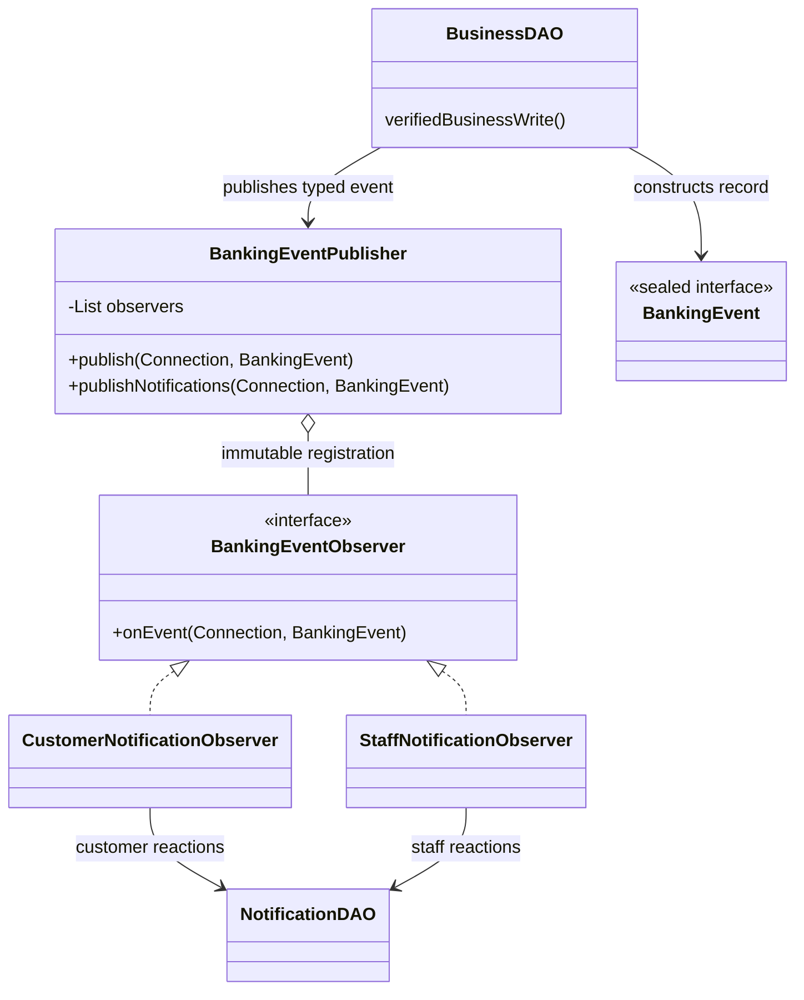

# SE2030 — Shared Observer Pattern viva guide

## Implemented scope and ownership

මේ document එක completed **Observer Pattern (Behavioral)** refactor එක ගැනයි. Dashboard Strategy, Card Factory, Investment Strategy, Singleton, Decorator, email/SMS සහ asynchronous delivery implement කරලා නැහැ. Existing routes, views, schema සහ notification read/unread API වෙනස් කරලා නැහැ.

Member allocation user විසින් proposal එකෙන් confirm කළ mapping එකයි. Proposal sections 7.4/7.5 copy-paste descriptions ownership evidence ලෙස use කරන්නේ නැහැ. Proposal file එක workspace එකෙන් හමු නොවූ නිසා scope සඳහා confirmed headings සහ actual code භාවිතා කළා. Proposal features සියල්ල implemented කියලා claim කරන්නේ නැහැ.

| Member | ID | Confirmed module |
|---|---|---|
| Ellepola E.I.W.A.S | IT25102492 | Loan Management |
| Mathuziyanth T | IT25100557 | Credit & Debit Card Management |
| Gunarathna A.A.K | IT25101484 | Investment & Payment Management |
| Monisha S | IT25103368 | Account & Service Request Management |
| Thennakoon T.P.J.H | IT25101687 | Customer Support, Complaint & Reporting Management |
| Sewmahal D.H.P | IT25103574 | Administration Management |

Compliance & Risk system role එකක්; seventh member/module assignment එකක් නොවේ. Its existing notification point shared implementation එකේ preserve කළා.

**Module ownership ≠ code authorship.** මේ refactor changes coding assistant විසින් generated කළා. Members personally wrote these changes කියලා මෙම document එක claim කරන්නේ නැහැ. එක් එක් member code review කරලා තමන්ගේ workflow, event, observer callback, transaction සහ demonstration තේරුම්ගෙන explain කරන්න ඕන.

Provided assessment requirement system එකේ at least one suitable pattern ගැනයි; six different patterns අවශ්‍ය බව සඳහන් නැහැ. Individual contribution/understanding lecturer assess කරන නිසා shared pattern එකේ තමන්ගේ integration points explain කළ යුතුයි. Marks guarantee කරන්නේ නැහැ.

## Original problem and why Observer fits

Before refactor, business DAOs directly called notification-specific methods:

```java
NotificationDAO.changed(c, NotificationDAO.Product.LOAN, loan);
```

Loan/card/investment/request decisions, payments, account changes සහ support actions වලට existing notifications තිබුණා. Business code notification reaction methods ගැන දැනගෙන තිබුණා. Customer notices සහ staff notices සඳහා common callback/registration mechanism එකක් තිබුණේ නැහැ.

Now the business code publishes a typed internal event:

```java
BankingEventPublisher.publishNotifications(c,
        new BankingEvent.ProductChanged(BankingEvent.Product.LOAN, loan));
```

Publisher registered observers දෙදෙනාට synchronous callbacks dispatch කරනවා. Observer relevant event එකක් නම් existing NotificationDAO persistence/rendering helper එක call කරනවා; irrelevant event එකක් නම් ignore කරනවා.

මෙය direct call එක rename කරපු wrapper එකක් පමණක් නොවේ: observer interface, immutable registration list, multiple concrete observers සහ iteration-based callback dispatch තියෙනවා. Account freeze event එකේ customer සහ staff observers දෙදෙනාම existing reactions execute කරනවා.

Existing notification text/SQL බොහොමයක් NotificationDAO තුළ reuse කළා. Business actions, balance calculations, authorization හෝ audit logic observers තුළට move කළේ නැහැ.

## Exact pattern roles

All implementation files are under `src/main/java/com/banking/dao/`.

| Role | File/class | Exact methods / purpose |
|---|---|---|
| Subject / Publisher | [BankingEventPublisher.java](../src/main/java/com/banking/dao/BankingEventPublisher.java) | Constructor copies registered observers using `List.copyOf`; `publish(Connection,BankingEvent)` loops and invokes callbacks; `publishNotifications(...)` dispatches through fixed production registration |
| Observer contract | [BankingEventObserver.java](../src/main/java/com/banking/dao/BankingEventObserver.java) | `onEvent(Connection,BankingEvent) throws SQLException` |
| Customer concrete observer | [CustomerNotificationObserver.java](../src/main/java/com/banking/dao/CustomerNotificationObserver.java) | `onEvent()` handles product/account/profile/payment/customer-ticket notices |
| Staff concrete observer | [StaffNotificationObserver.java](../src/main/java/com/banking/dao/StaffNotificationObserver.java) | `onEvent()` handles submissions, frozen-account admin notice, registration, employee access, department ticket notices and customer replies |
| Typed event contract | [BankingEvent.java](../src/main/java/com/banking/dao/BankingEvent.java) | Sealed interface and immutable record payloads; nested `Product` enum keeps trusted product/table metadata |
| Existing persistence collaborator | [NotificationDAO.java](../src/main/java/com/banking/dao/NotificationDAO.java) | `submitted`, `changed`, `accountChanged`, new `accountStaffChanged`, `profileChanged`, `registered`, `employeeAccess`, `payment`, `paymentId`, `customer`, `department`, `customerReply` |
| Event producers | Existing DAOs listed in member sections | Publish only at existing successful-write notification points |
| Transaction owner | Existing DAO / `Jdbc.transaction()` | Starts transaction, commits or rolls back; publisher/observers do neither |

`NOTIFICATIONS` is fixed shared registration, not a newly introduced Singleton Pattern contract. No mutable subscribe/unsubscribe UI or session registration exists. Constructor registration is sufficient for this fixed Observer use case.



## Event routing

| Typed record | Payload | Customer reaction | Staff reaction |
|---|---|---|---|
| `ProductSubmitted` | Product enum, entity ID | None | Relevant active product officer role |
| `ProductChanged` | Product enum, entity ID, optional existing action | Entity owner's existing status notice | None |
| `AccountChanged` | Account number | Owner's account status notice | Admin notice only if FROZEN |
| `ProfileChanged` | Customer ID | Existing profile access notice | None |
| `CustomerRegistered` | Customer ID | None | Active administrators |
| `EmployeeAccessChanged` | Employee ID, actor ID | None | Other active administrators, actor excluded |
| `PaymentRecorded` | Existing reference | Payer; receiver also for completed transfer | None |
| `PaymentChanged` | Existing payment ID | Resolve reference, preserve payment reaction/deduplication | None |
| `CustomerReplied` | Ticket ID | None | Assigned department, not just last handler |
| `TicketCustomerNotice` | Ticket ID, existing type/title/message | Ticket owner | None |
| `TicketDepartmentNotice` | Ticket ID, role, optional specific officer/actor, existing type/title/message | None | Existing active department recipients with actor exclusion |

Ticket records retain existing message strings and notification types to keep this refactor small. Thus support producers still construct some display text; complete message-rendering decoupling is not claimed. Recipient ownership queries remain server-side. Event records are internal, not a new HTTP API.

## 1. Ellepola E.I.W.A.S — IT25102492 — Loan Management

### Actual flow and changed code

- Customer `/customer/loans` form → `CustomerServicesServlet.doPost()` → `LoanDAO.apply()` → `ProductSubmitted(LOAN,id)` → staff observer → `NotificationDAO.submitted()` → active Loan Officers.
- `LoanDAO.decision()` from `EmployeeServlet.doPost()` → `ProductChanged(LOAN,id)` → customer observer → `changed()` → loan owner receives approved/rejected notice.
- `LoanDAO.cancel()` → existing cancellation notice through `ProductChanged`.
- `LoanDAO.accept()` retains account credit/installment insertion → `ProductChanged` for ACTIVE loan. Its existing `FinancialLedger.record()` separately publishes the **payment** event. These are different existing notices, not duplicate publication of one event.
- `LoanRepaymentDAO.pay()` retains recorded installment amount and payment record → `PaymentRecorded`; final repayment publishes `ProductChanged` only when loan actually closes.
- `EmployeeDAO.act()` remaining legacy `loan-reject` notification point also publishes `ProductChanged`.

Changed files: `LoanDAO.java`, `LoanRepaymentDAO.java`; shared `FinancialLedger.java`, `EmployeeDAO.java`. Loan rates/installment rules in `DemoRules` unchanged. Application update remains silent where it was silent before.

### Demonstration

Use customer and Loan Officer sessions. Apply for a valid loan; show officer notice. Approve; show customer notice. Customer accepts; show account credit, ACTIVE state and recorded installment schedule. Repay a one-installment test loan; show payment and CLOSED loan notices. Repeat approval/acceptance/repayment to show no extra successful transition/notice.

### Viva

| Question | Simple answer |
|---|---|
| Observer fits මෙතන ඇයි? | Loan lifecycle change එකක් වෙද්දී existing notification component react කරනවා; loan DAO recipient/message persistence method එක select කරන්නේ නැහැ. |
| Loan types සඳහා Strategy නැත්තේ ඇයි? | Current loan types ඔක්කොම එකම configured rate සහ algorithm භාවිතා කරනවා; duplicate classes force කළේ නැහැ. |
| Approval එකෙන් funds ලැබෙනවද? | නැහැ; customer acceptance එකෙන් disbursement වෙනවා. |
| New observer එකක් add කරන්නේ කොහොමද? | Interface implement කරලා publisher registration එකට add කරනවා; existing transaction rules obey කරන්න ඕන. |

## 2. Mathuziyanth T — IT25100557 — Credit & Debit Card Management

### Actual flow and changed code

- Customer `/customer/cards` → `CustomerServicesServlet` → `CardDAO.apply()` → existing common and debit/credit subtype inserts → `ProductSubmitted(CARD,id)` → active Card Services Officers.
- `CardDAO.process()` approve/reject/block/unblock/close → `ProductChanged(CARD,id,action)` → customer observer → card owner's existing notice.
- `CardDAO.customerAction()` block/cancel/close uses the same event; **limit edits stay silent**.
- Optional `action` preserves rejection wording even though rejected cards use existing CANCELLED status.
- Legacy points in `CustomerServicesDAO.blockCard()` and `EmployeeDAO.act()` retain their existing notices through typed events.

Changed files: `CardDAO.java`; shared `CustomerServicesDAO.java`, `EmployeeDAO.java`. No Card Factory added, no card-network issuance added, no subtype schema change.

### Demonstration

Request debit and credit cards; show correct officer notices and subtype records using read-only SQL if needed. Approve, block and unblock one card; show owner notices. Reject a pending card and show rejection wording. Edit daily limit and demonstrate that no extra notice is created. Show duplicate-request/closure-debt guard behavior.

### Viva

| Question | Simple answer |
|---|---|
| Concrete observer කවුද? | Staff submission සඳහා `StaffNotificationObserver`; status changes සඳහා `CustomerNotificationObserver`. |
| Action field එක අවශ්‍ය ඇයි? | REJECTED meaning එක current schema CANCELLED status එකෙන් පමණක් හඳුනාගන්න බැහැ; existing rejection message preserve කරන්න action යවනවා. |
| Card creation changed ද? | නැහැ; original transaction සහ debit/credit SQL 그대로 තියෙනවා. |
| New card notification reaction? | Existing/new typed event එක handle කරන observer implementation එක register කරන්න; unsupported card type එකක් invent කරන්න එපා. |

## 3. Gunarathna A.A.K — IT25101484 — Investment & Payment Management

### Actual flow and changed code

- Investment form → `CustomerServicesServlet` → `InvestmentDAO.apply()` → `ProductSubmitted(INVESTMENT,id)` → Investment Officers.
- `process()` approval/funding/rejection, `cancel()`, `payout()` withdrawal/maturity closure → `ProductChanged` → investment owner.
- Investment funding/payout use `FinancialLedger.record()` → `PaymentRecorded(reference)` once for the existing financial notice. Caller does not republish that payment event.
- Bill form → `PaymentServlet` → `PaymentDAO.makeBillPayment()` → `PaymentRecorded` → payer.
- Transfer form → `TransferServlet` → `TransferDAO.transferMoney()` → `PaymentRecorded` → payer and actual receiver from recorded account.
- Schedule form → `ScheduledPaymentServlet` → `ScheduledPaymentDAO.cancel()/execute()` → `PaymentChanged(id)` → existing cancellation/completion notice. Schedule create/edit remain silent.
- Shared staff cash deposit/withdrawal in `CashTransactionDAO` also publishes `PaymentRecorded`; this is operational overlap with Customer Service role, not a new owner assignment.

Changed files: `InvestmentDAO.java`, `PaymentDAO.java`, `TransferDAO.java`, `ScheduledPaymentDAO.java`, `CashTransactionDAO.java`, shared `FinancialLedger.java`.

### Demonstration

Approve/fund an investment and show debit and notices; withdraw or process maturity and show credited payout/closed status. Transfer between two test customers and show both balances and both notifications. Execute an already-due scheduled payment, then retry it. Demonstrate failed insufficient-funds operation creates no committed payment/notification.

### Viva

| Question | Simple answer |
|---|---|
| Double notification prevent කරන්නේ කොහොමද? | Payment row lock සහ existing recipient/type/message deduplication preserve කළා; shared helper සහ caller දෙකෙන් same payment event publish කරන්නේ නැහැ. |
| Interest formula changed ද? | නැහැ; recorded terms සහ existing `DemoRules` unchanged. |
| Scheduled payment background job ද? | නැහැ; existing explicit execute action එකමයි. |
| New payment observer add කළොත්? | Register new implementation; balances update කරන responsibility DAO එකේම තියෙනවා. |

## 4. Monisha S — IT25103368 — Account & Service Request Management

### Actual flow and changed code

- Registration → `RegisterServlet` → `CustomerDAO.createCustomerAndAccount()` → `AccountChanged(accountNumber)` for customer and `CustomerRegistered(customerId)` for administrators. These are two distinct existing reactions.
- Customer request form → `CustomerServicesServlet` → `ServiceRequestDAO.create()` → `ProductSubmitted(REQUEST,id)` → Customer Service Officers.
- Officer processing → `EmployeeServlet` → `ServiceRequestDAO.process()` → existing fulfillment switch → `ProductChanged` when status/response genuinely changes → customer notice.
- `ServiceRequestDAO.update()` cancellation publishes; ordinary description edit stays silent.
- Account opening/closure in `AccountWorkflowDAO.open()/close()` publishes `AccountChanged` within caller transaction.
- Profile deactivation in `AccountWorkflowDAO.deactivate(Connection,int)` publishes `ProfileChanged`. Admin deactivation reuses helper; no duplicate caller event added.
- Legacy request creation/review points in `CustomerServicesDAO.request()` and `EmployeeDAO.act()` also migrated.

Changed files: `AccountWorkflowDAO.java`, `CustomerDAO.java`, `ServiceRequestDAO.java`; shared `CustomerServicesDAO.java`, `EmployeeDAO.java`. Service fulfillment Strategy not added.

### Demonstration

Submit and complete account-opening request; show new account and request notices. Complete profile-update or statement request; show result. Try closing an account with balance/outstanding obligations and show rejection. Use a zero-balance eligible account to demonstrate successful closure. Account deactivation/registration demo uses test fixtures, not real financial records.

### Viva

| Question | Simple answer |
|---|---|
| Account event සහ request event දෙක duplicate ද? | නැහැ; account status සහ request status වෙනස් business records දෙකක්; notices දෙකම කලින් තිබුණා. |
| Ownership check remove කළාද? | නැහැ; authenticated identity සහ existing account/customer queries unchanged. |
| Observer account close කරනවද? | නැහැ; workflow DAO close කරලා event publish කරනවා; observer notice ලියනවා. |
| New service request type? | Existing validation/fulfillment code සහ UI/data support update කරන්න ඕන; notifications සඳහා existing request event reuse කරන්න පුළුවන්. |

## 5. Thennakoon T.P.J.H — IT25101687 — Customer Support, Complaint & Reporting Management

### Actual flow and changed code

- Complaint/support form → `CustomerServicesServlet` → `CustomerServicesDAO.ticket()` → `TicketDepartmentNotice` → active Customer Service Officers; existing complaint-specific title/message preserved.
- Assignment → `EmployeeServlet` → `TicketDAO.assign()` → existing `TicketCustomerNotice` and `TicketDepartmentNotice` → owner and target department; acting employee excluded from staff notice.
- Officer reply/status → `TicketDAO.update()` → customer notice events; escalation also produces department notice with actor exclusion. Same status repeats remain silent as before.
- Customer reply → `CustomerServicesDAO.reply()` → `CustomerReplied(ticketId)` → entire assigned department. `assigned_employee_id` is last handler, not exclusive ownership.
- Existing message records, status restrictions and privacy remain unchanged. Customer edits/self-closure in `ServiceRequestDAO.ticketUpdate()` had no notification before; none invented now.

Changed files: `TicketDAO.java`, `CustomerServicesDAO.java`.

**Reporting distinction:** actual admin report implementation exists in `ReportDAO.generate()`, `AdminReportServlet`, `AdminReportPdf` and `WEB-INF/admin/reports.jsp`, protected by SYSTEM_ADMIN. It logs `REPORT_GENERATED` but had no notification point. No report event/notice was added. Confirm collaboration/demo access with Administration member; module heading does not override runtime permissions or prove a separate customer complaint-report implementation exists.

### Demonstration

Submit complaint, assign department, reply, customer follow-up, resolve and close. Show owner/department notices and actor exclusion using a second officer. Demonstrate unrelated department denial. For implemented reporting, use an authorized admin session to show existing report filters/preview/PDF; explain that reporting contributes through existing feature, while this member's Observer integration is in support/complaint workflows.

### Viva

| Question | Simple answer |
|---|---|
| Customers observers ද? | නැහැ; Java notification components observers; customers database recipients. |
| Report notification නැත්තේ ඇයි? | Existing code එකේ එවැනි notice එකක් තිබුණේ නැහැ; pattern demonstration සඳහා feature invent කළේ නැහැ. |
| Ticket දෙපාර්තමේන්තුවටම reply notice යවන්නේ ඇයි? | Current routing department-wide; last employee ID exclusive owner නෙවෙයි. |
| New support reaction? | Appropriate typed event handle කරන observer register කරන්න; ticket permissions/status rules වෙනම preserve කරන්න. |

## 6. Sewmahal D.H.P — IT25103574 — Administration Management

### Actual flow and changed code

- Admin employee form → `AccessFilter` → `EmployeeServlet.doPost()` → `AdminDAO.employee()` → persisted role/status genuinely changes → `EmployeeAccessChanged(employeeId,adminId)` → staff observer → other active administrators. Ordinary name/contact edits stay silent.
- Legacy employee-status action → `EmployeeDAO.act()` → same event; acting administrator excluded.
- `AdminDAO.customerStatus()` reactivation → `ProfileChanged` → customer observer. Deactivation uses `AccountWorkflowDAO.deactivate()` which publishes once.
- Customer registration in Account module emits `CustomerRegistered`; Administration receives existing notice through shared staff observer.
- Compliance `EmployeeDAO.act()` freeze/unfreeze → `AccountChanged`; customer observer writes owner notice; staff observer writes admin notice only for FROZEN. Compliance is a system role, not another member.

Changed files: `AdminDAO.java`, shared `EmployeeDAO.java`. Product management, dashboards, self-access restrictions, recent activity and reports remain unchanged; no optional Dashboard Strategy added.

### Demonstration

Use two active admin sessions. First admin changes another employee's role/status. Show notice for second admin and absence for acting admin; show audit/status. Repeat unchanged edit and show no additional notice. Demonstrate self-access guard and customer reactivation. Coordinate account-freeze demo to show one AccountChanged event invokes both observers. Existing product/report demonstrations remain useful without extra notifications.

### Viva

| Question | Simple answer |
|---|---|
| Your concrete contribution point? | Admin employee/customer access write points publish typed events; callbacks preserve recipients, actor exclusion and rollback. Generated code මම review/understand කරනවා; personally authored කියලා claim කරන්නේ නැහැ. |
| Singleton choose නොකළේ ඇයි? | Exactly one AdminDAO instance අවශ්‍ය requirement නැහැ; existing notification reactions සඳහා Observer natural fit එකක්. |
| Subject කවුද? | `BankingEventPublisher`; `publish()` registered observersගේ `onEvent()` invoke කරනවා. |
| New observer safely add කරන්නේ කොහොමද? | Stateless implementation එක constructor registration list එකට add කරන්න; no independent connection/commit/close. |

## Transaction and concurrency contract

```text
DAO begins transaction
  → existing auth/ownership/locks
  → existing business write
  → publishNotifications(same Connection, typed event)
  → CustomerNotificationObserver.onEvent
  → StaffNotificationObserver.onEvent
  → DAO commits (or existing handler rolls back on failure)
```

- Publisher callbacks synchronous; exceptions are not swallowed. SQLException/runtime failure reaches existing handler.
- Publisher and observers do not open independent connections, commit, rollback, close or retain caller connection.
- Called notification creation helpers use that connection. NotificationDAO read/unread operations still legitimately open their own connections outside callbacks.
- Business rows/notifications visible together after commit. Publisher is called before commit, not after-commit asynchronous delivery.
- If customer observer succeeds and staff observer fails, transaction owner rolls back earlier customer notice and business update.
- Observer objects contain no fields; registration snapshot immutable. Concurrent servlet requests do not modify subscriber list. This does not make one JDBC Connection safe for concurrent threads; real requests keep their own existing connections.
- Existing SQL locks, actor exclusions, audit placement, balances and transition eligibility remain intact.
- Existing payment deduplication retained even after notices are read. Not all events are globally replay-idempotent: product/account/ticket notices still rely on existing successful transition checks. No event persistence/outbox/retry feature added.
- AccountChanged staff reaction performs one extra account query to separate responsibilities; uses caller transaction and recorded status.

## Benefits and drawbacks

Benefits: actual Observer roles visible; workflows publish typed events instead of selecting notification reaction helpers; customer/staff responsibilities separate; fixed registration is easy to explain; all six modules participate through existing features; financial atomicity preserved.

Drawbacks: more classes and callback indirection; a notification failure still fails the business transaction, preserving existing behavior; synchronous callbacks add work before commit; messages remain partly in support producers; new typed event variants require observer routing review. No durable event log, automatic retries or external delivery guaranteed.

## Verification and reproducible command

Run from project root:

```powershell
.\tools\Test-Observer.ps1
```

Override `-JavaHome` / `-TomcatHome` if local paths differ. Configure existing `BANK_DB_*` environment variables or JVM database properties privately if needed; do not commit credentials.

The runner builds the WAR, compiles and runs:

- `tools/ObserverDispatchTest.java`: callback connection/event identity, copied registration, synchronous order, unchanged SQL/runtime failure propagation, stopping after failure, concurrent publication and concrete observer filtering.
- `tools/BankingNotificationTest.java --observer-report`: existing DAO and real HTTP/JSP/session workflows for all modules; correct recipients, card rejection wording, silent edits/GET refreshes, read/unread/ownership, repeated transitions, concurrent payment deduplication and notification failures.
- Focused additions cover second-observer failure after successful customer write, account/audit rollback, admin actor exclusion, multi-officer complaint recipients, exact existing complaint text, assignment/escalation exclusions and department-wide customer reply.

Database isolation: banking harness reads configured schema definitions only; creates `banking_test_notifications_<timestamp>`, switches JDBC URL before fixtures/DML, then drops only that validated disposable database in `finally`. No production records copied or updated. Test triggers exist only in disposable database. Source schema must contain current required tables; script does not migrate production.

Result JSON: `target/observer-banking-notification-tests.json`. Generated WAR/harness output stays under target. No push/deploy performed. HTTP/JSP checks run against isolated loopback Tomcat; visual screenshot/browser automation is not part of this runner.

Verified on 2026-10-03: `tools/Test-Observer.ps1` exited 0. Maven WAR build passed; ObserverDispatchTest **8 checks passed**; BankingNotificationTest **189 checks passed**. Final recipient tests include inactive staff exclusion and exact complaint message preservation. This is 197 harness checks, not Maven Surefire test counts.

Three additional existing isolated mock harnesses were attempted: `FinancialSafetyTest`, `InvestmentSafetyTest`, `CashTransactionSafetyTest`. They fail on existing notification JDBC queries/metadata. Each failure reproduced against separately compiled unchanged HEAD source, so these are pre-existing mock compatibility limitations, not passing checks and not fixed in this focused refactor. Real database banking tests cover corresponding financial workflows. Do not count partial mock assertions as full passes.

Tomcat teardown may emit existing JDBC cleanup/module-access warnings; they are not application assertion failures. Current production deployment and historical backup schema were not altered. Manual presentation scenarios above are instructions for members, not claims that every screen scenario was manually performed by the assistant.

## Viva preparation checklist

Each member should locate their DAO publication line, identify the exact typed record and its fields, trace publisher registration → callback → NotificationDAO SQL, explain authenticated ownership/recipient selection, and show a genuine success plus a rejected/repeated operation. Know who owns commit/rollback. Show your actual module's existing UI feature and distinguish shared infrastructure contribution from authorship. Understand that an ordinary interface, static utility, CRUD method or framework listener alone was not proof of the lecture pattern before this refactor.
